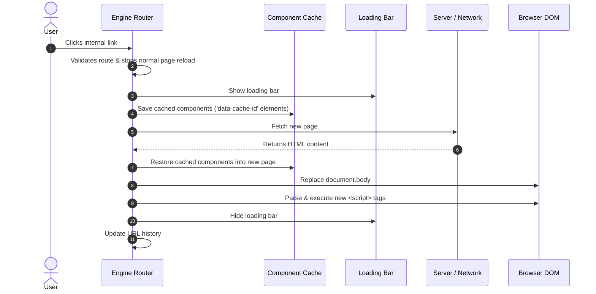

# Vanilla JS Single Page Application

This project is a Single Page Application (SPA) engine built entirely with pure JavaScript. It does not use any external libraries or frameworks for the application code or the testing logic.

## Current Implementation Status

All core requirements for the SPA engine have been implemented:
- **Routing:** Intercepts link clicks and uses the Browser History API to update the URL without a full page reload.
- **Content Loading:** Fetches HTML content and replaces the document body.
- **Script Execution:** Evaluates and runs `<script>` tags found in the new HTML content.
- **Component Caching:** Allows specific elements (marked with `data-cache-id`) to be saved in memory and restored between page navigations, keeping their state intact.
- **Loading UI:** Displays a simple progress bar while new pages are being fetched.
- **Unit Tests:** Includes a custom testing setup (in the `tests/` folder) to verify the engine's behavior directly in the browser.
- **Deployment:** A GitHub Actions workflow is set up to deploy the `src/` folder to GitHub Pages when changes are merged to the main branch.

## Architecture Flow



## How to Run

Because the project uses ES6 modules, the files need to be served via a local web server. The project includes a `package.json` that provides a local server specifically for development.

1. Install the local server dependency:
   ```bash
   npm install
   ```

2. Start the application:
   ```bash
   npm start
   ```

3. Run the unit tests:
   ```bash
   npm test
   ```
