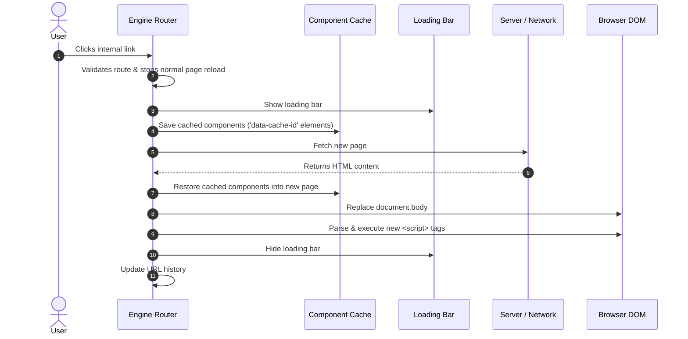

# Vanilla JS SPA Engine

A Single Page Application engine built with plain JavaScript. It converts multi-page websites into single-page applications without requiring external libraries.

## How to Use the Engine

### 1. Initialization
Import the engine in your main JavaScript file and define which URL paths the engine should manage.

```javascript
import { Engine } from './core/engine.js';

const engine = new Engine({
    enabled: true, // Turn the SPA behavior on or off
    routes: [
        '*.html',        // Matches all HTML files
        '/site/*',       // Matches anything in the /site/ folder
        '/exact-path',   // Exact path match
        /^\/api\/.*$/,   // Regular expressions
        (path) => path.startsWith('/dynamic') // Custom functions
    ]
});
```

### 2. Protect Core Scripts
To stop the engine from running your main application code again every time a new page loads, you must add the `data-spa-core` attribute to your main script tag in your HTML.

```html
<script type="module" src="./app.js" data-spa-core></script>
```

### 3. Exclude Specific Links
If you want a specific link to trigger a normal page reload instead of being handled by the engine, add the `data-no-spa` attribute:

```html
<a href="/about.html" data-no-spa="true">Normal Page Reload</a>
```

### 4. Component Caching
To keep a component's state (like text in an input field or a checkbox) when moving between pages, add a unique `data-cache-id` to its container.

```html
<div data-cache-id="my-sidebar">
    <!-- Component content -->
</div>
```
When a user clicks a link, the engine takes this exact HTML element and places it into the new page. You can listen for the `spa:save` and `spa:restore` events on this element to save and load your custom JavaScript data.

## How it Works

1. **Click Detection**: The engine listens for all clicks on the page. When it detects a click on a link, it checks if the link matches your defined routes and ensures the user isn't holding down a modifier key (like Ctrl or Command).
2. **Fetching Content**: If the link matches, the engine stops the default browser loading process, shows a loading bar, and downloads the new HTML content using the `fetch` function. 
3. **Updating the Page**: The engine reads the new HTML, extracts the body and the title, and replaces the current page content. During this process, it keeps track of the cached components and places them in the new page. A limit is enforced on how many components are kept in memory to prevent the application from slowing down over time.
4. **Running Scripts**: Browsers do not run scripts when HTML is updated this way. The engine manually copies all new script tags and inserts them into the page to force the browser to run them (ignoring scripts marked with `data-spa-core`).
5. **Browser History**: The engine updates the web address bar and manages the back and forward browser buttons using the History API.

## Architecture Flow



## How to Run

The files need to be served via a local web server because ES6 modules are used.

1. Install the local server:
   ```bash
   npm install
   ```

2. Start the application:
   ```bash
   npm start
   ```

3. Run the unit tests:
   ```bash
   npm test
   ```

## Test Suite & Micro Framework

The project includes a built-in, zero-dependency testing framework and an in-browser test runner.

```
tests/
├── index.html                 # Visual in-browser test runner dashboard
├── test-micro-framework.js    # Test runner and assertion utilities
└── engine.test.js             # Unit test suite covering all engine capabilities
```

### 1. The Micro Framework (`tests/test-micro-framework.js`)

A lightweight testing utility that runs natively in modern browsers without requiring external dependencies or build tools:

* **`it(description, testFunction)`**: Executes a test function. Upon execution, it dynamically appends a styled result block to the DOM, capturing thrown errors and rendering the error stack trace if a failure occurs.
* **`assertEqual(actual, expected)`**: Validates primitive equality and performs deep equality checks on arrays. Throws a descriptive error on mismatch.
* **`assertTrue(value)` / `assertFalse(value)`**: Semantic boolean assertion helpers.

```javascript
import { it, assertEqual, assertTrue, assertFalse } from './test-micro-framework.js';

it('validates equality correctly', () => {
    assertEqual('value', 'value');
    assertTrue(true);
});
```

### 2. In-Browser Test Runner (`tests/index.html`)

Tests are executed and rendered visually inside an interactive HTML test runner:

* **Live Status Banners**: Green banners (`.success`) indicate passed tests; red banners (`.failure`) highlight failed assertions with full stack traces.
* **Real DOM Environment**: Tests run against real browser DOM APIs (`DOMParser`, `History API`, `CustomEvent`, `<script>` tag lifecycle), ensuring high fidelity without synthetic or mocked DOM layers.
* **Auto-Reload**: When running `npm test`, the local server watches test files and automatically re-executes tests upon save.

### 3. Test Coverage & Key Test Functions (`tests/engine.test.js`)

The test suite validates core capabilities, state management, and navigation edge cases:

#### Route Matching (`isRouteMatched`)
* **Exact String Matching**: Verifies exact path matching (e.g., `/about.html`).
* **Wildcard Patterns**: Validates glob patterns (e.g., `/site/*`, `*.html`).
* **Function Predicates**: Validates custom matching functions (e.g., `(path) => path.startsWith('/api/')`).

#### Navigation & Link Interception (`shouldIntercept`)
* **`data-no-spa` Exclusions**: Ensures links with `data-no-spa="true"` or boolean attributes trigger standard browser reloads.
* **External Domains & Protocols**: Ensures external URLs (`https://example.com`) bypass the SPA router.
* **Hash Anchor Links**: Confirms that in-page hash navigations (`#section`) do not trigger AJAX requests.
* **Target & Download Flags**: Ensures links with `target="_blank"` or `download` attributes behave natively.
* **Engine Enable/Disable State**: Validates that setting `enabled: false` deactivates interceptors.

#### Page Rendering & Script Execution (`renderPage`, `executeScripts`)
* **DOM & Title Synchronization**: Verifies that `document.title` and `document.body` update correctly with incoming HTML.
* **Dynamic Script Execution**: Confirms that dynamically loaded `<script>` tags are cloned and replaced to trigger execution.
* **Singleton Protection (`data-spa-core`)**: Confirms scripts marked with `data-spa-core` are skipped during navigation to prevent re-initializing main application code.

#### Component State Retention & LRU Caching (`ComponentCache`)
* **Live Node Caching**: Verifies that DOM elements marked with `data-cache-id` are cached and restored into new pages.
* **Native State Retention**: Confirms un-serialized DOM state (such as input values and checkbox states) persists across navigations without loss.
* **Lifecycle Events (`spa:save`, `spa:restore`)**: Validates custom event dispatching for saving and restoring JavaScript component state.
* **LRU Eviction**: Validates that the cache enforces `maxSize` by evicting the oldest entries and updating access order on restoration.

#### UI Feedback (`LoadingBar`)
* **Loading Bar DOM Mounting**: Verifies `#spa-loading-bar` is injected into the DOM and correctly toggles opacity and width styles during navigation.

